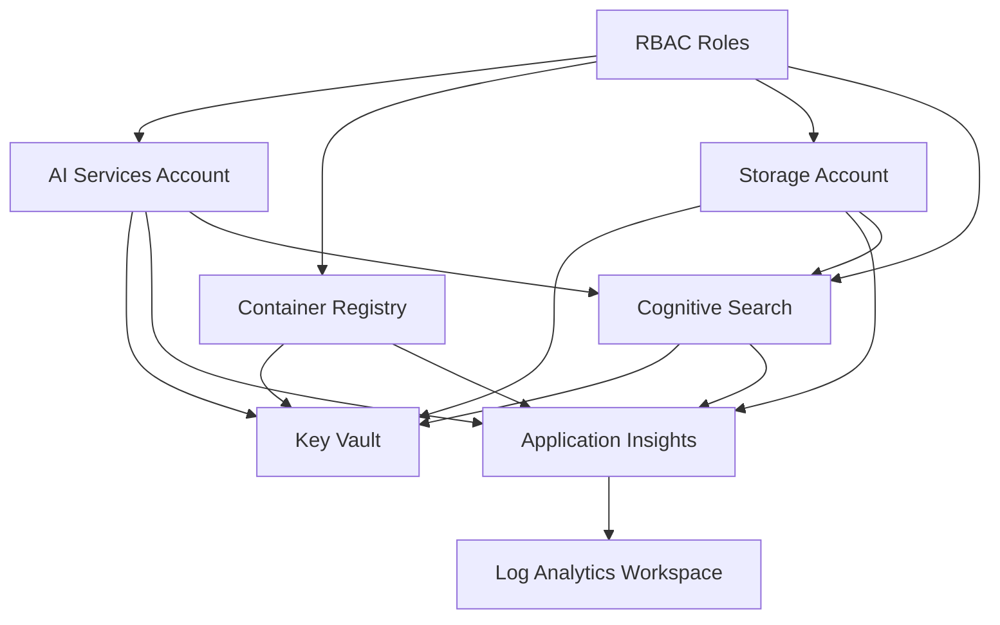

# Azure AI Foundry Project Creation

[](https://www.python.org/downloads/)
[](https://docs.microsoft.com/en-us/cli/azure/)
[](LICENSE)
[](https://pre-commit.com/)

A comprehensive Python automation suite for deploying Azure AI Foundry projects with enterprise-grade security, monitoring, and development tools.

## 🎯 Project Objective

This repository provides a complete automated solution for deploying and managing Azure AI Foundry environments. The primary objective is to eliminate manual setup complexity while ensuring enterprise-grade security, monitoring, and compliance from day one.

**Core Goals:**
- **Zero-Configuration Deployment**: Automated infrastructure provisioning with sensible defaults
- **Enterprise Security**: Built-in security best practices, Key Vault integration, and RBAC
- **Development Ready**: Pre-configured monitoring, logging, and development tools
- **Code Quality Assurance**: Comprehensive pre-commit hooks and automated testing
- **Production Ready**: Scalable architecture suitable for development through production

## 📝 Script Overview

This suite includes five specialized Python scripts, each serving a specific purpose in the deployment lifecycle:

### 🚀 **`create-ai-foundry-project.py`** - Primary Deployment Script
**Purpose**: Automated Azure AI Foundry infrastructure deployment
- Provisions all required Azure resources (Key Vault, AI Services, Container Registry, Storage, etc.)
- Configures security settings and RBAC permissions
- Sets up monitoring and logging infrastructure
- Stores secrets securely in Key Vault
- Generates deployment summary and documentation

### ✅ **`validate-ai-foundry-deployment.py`** - Comprehensive Validation
**Purpose**: Post-deployment validation and health checks
- Verifies all resources are properly configured and accessible
- Tests authentication and permission settings
- Validates Key Vault access and secret retrieval
- Checks monitoring and logging configuration
- Generates detailed validation reports with recommendations

### 🔐 **`validate-keyvault-access.py`** - Security Validation
**Purpose**: Focused Key Vault security and access testing
- Tests Key Vault authentication and access policies
- Validates secret retrieval capabilities
- Checks encryption and security configurations
- Verifies RBAC permissions for Key Vault operations

### ⚡ **`quick-resource-check.py`** - Fast Status Verification
**Purpose**: Rapid resource status and connectivity check
- Quick health check of all deployed resources
- Fast authentication and connectivity verification
- Resource existence and basic configuration validation
- Ideal for CI/CD pipelines and automated monitoring

### 📊 **`deployment-summary.py`** - Post-Deployment Guidance
**Purpose**: Comprehensive deployment overview and next steps
- Displays deployment status and resource information
- Provides getting started guidance and sample code
- Shows cost estimates and monitoring setup
- Offers troubleshooting tips and best practices

## 🚀 Quick Start

```bash
# 1. Clone and setup environment
git clone <repository-url>
cd create_ai_foundry

# 2. Create and activate virtual environment
python -m venv venv
source venv/bin/activate  # On Windows: venv\Scripts\activate

# 3. Install dependencies
pip install -r requirements.txt

# 4. Configure environment variables
cp .env.example .env
# Edit .env with your specific values

# 5. Preview deployment
python create-ai-foundry-project.py --dry-run

# 6. Execute deployment
python create-ai-foundry-project.py
```

## 📋 Table of Contents

- [Project Objective](#project-objective)
- [Script Overview](#script-overview)
- [Quick Start](#quick-start)
- [Features](#features)
- [Prerequisites](#prerequisites)
- [Installation](#installation)
- [Configuration](#configuration)
- [Usage](#usage)
- [Architecture](#architecture)
- [Resources Created](#resources-created)
- [Security Features](#security-features)
- [Code Quality & Security](#code-quality--security)
- [Monitoring & Observability](#monitoring--observability)
- [Cost Optimization](#cost-optimization)
- [Troubleshooting](#troubleshooting)
- [Development](#development)
- [Contributing](#contributing)
- [License](#license)

## 🎯 Overview

Azure AI Foundry represents Microsoft's modern approach to AI development, providing a unified platform for building, deploying, and managing AI solutions. This script automates the creation of a complete AI Foundry environment with all necessary supporting infrastructure.

### What is Azure AI Foundry?

Azure AI Foundry is a standalone AI development platform that provides:
- **Unified AI Development**: Single environment for all AI workloads
- **Integrated AI Services**: OpenAI, Cognitive Services, and custom models
- **Built-in MLOps**: End-to-end machine learning operations
- **Enterprise Security**: Advanced security and compliance features
- **Seamless Integration**: Works with Azure DevOps, GitHub, and other tools

## ✨ Features

### 🔧 Core Capabilities
- **Automated Deployment**: One-click deployment of complete AI infrastructure
- **Enterprise Security**: Key Vault integration, RBAC, and secure authentication
- **Monitoring Ready**: Application Insights and Log Analytics pre-configured
- **Developer Friendly**: Optimized for AI/ML development workflows
- **Cost Optimized**: Uses appropriate SKUs for development and production

### 🛡️ Security Features
- **Zero Hardcoded Secrets**: All credentials stored in Key Vault
- **RBAC Integration**: Proper role-based access control
- **Audit Logging**: Comprehensive logging for all operations
- **Encryption**: End-to-end encryption for all data
- **Compliance Ready**: Follows Azure security best practices
- **AI Security Testing**: PyRIT integration ready for AI model security validation

### 🔍 AI-Powered Search & Knowledge Mining
- **Cognitive Search Integration**: Azure Cognitive Search service for AI-powered search capabilities
- **Vector Search**: Support for semantic search and vector embeddings
- **Knowledge Mining**: Extract insights from unstructured data
- **Search Analytics**: Built-in analytics and monitoring for search performance
- **Multi-modal Search**: Support for text, images, and other content types
- **AI Enrichment**: Built-in AI skills for content enrichment and analysis

### 🤖 AI Security Testing (PyRIT Integration)
- **Prompt Injection Testing**: Validates AI models against jailbreak attempts
- **Bias Detection**: Identifies potential bias in AI responses
- **Content Filtering**: Ensures harmful content is properly blocked
- **Safety Guardrails**: Validates that AI safety measures are working
- **Automated Testing**: Integrates with CI/CD pipeline for continuous security validation
- **Compliance Ready**: Supports AI governance and regulatory requirements

### 📊 Monitoring & Observability
- **Centralized Logging**: Log Analytics workspace for all resources
- **Application Monitoring**: Application Insights for AI workload tracking
- **Custom Metrics**: Support for custom AI model metrics
- **Alerting**: Built-in alerting capabilities for AI operations

### 🧪 Code Quality & DevOps
- **Pre-commit Hooks**: Automated code quality and security validation
- **Type Safety**: Comprehensive MyPy type checking with strict mode
- **Security Scanning**: Bandit, pip-audit, and Snyk vulnerability detection
- **Code Formatting**: Black and isort with 79-character line limits
- **Enterprise Standards**: PEP 8 compliance and comprehensive documentation
- **AI Security Testing**: PyRIT readiness checks for AI model security validation

## 🧠 AI Capabilities & Integration

### Azure Cognitive Search Integration

The deployed Cognitive Search service provides powerful AI-driven search and knowledge mining capabilities:

#### **Search Capabilities**
- **Full-text Search**: Advanced text search with ranking and relevance
- **Vector Search**: Semantic search using AI embeddings
- **Hybrid Search**: Combine keyword and semantic search for best results
- **Faceted Search**: Dynamic filtering and navigation
- **Autocomplete & Suggestions**: Real-time search suggestions

#### **AI Enrichment**
- **Built-in AI Skills**: Text extraction, OCR, entity recognition
- **Custom Skills**: Integrate custom AI models and processing
- **Knowledge Store**: Extract and store structured data from unstructured content
- **Cognitive Skills Pipeline**: Chain multiple AI operations together

#### **Integration with AI Services**
- **Seamless Connection**: Automatically connected to your AI Services account
- **Shared Authentication**: Uses the same Key Vault for credential management
- **Unified Logging**: Integrated with your Log Analytics workspace
- **Cost Optimization**: Shared AI Services account reduces costs

### Usage Examples

#### **Basic Search Implementation**
```python
from azure.search.documents import SearchClient
from azure.core.credentials import AzureKeyCredential

# Retrieve credentials from Key Vault
search_endpoint = "https://your-search-service.search.windows.net"
search_key = "your-search-admin-key"  # From Key Vault

# Initialize search client
search_client = SearchClient(
    endpoint=search_endpoint,
    index_name="your-index",
    credential=AzureKeyCredential(search_key)
)

# Perform search
results = search_client.search(
    search_text="AI development",
    top=10,
    select=["id", "title", "content"]
)
```

#### **Vector Search with AI Embeddings**
```python
from azure.search.documents.models import VectorizedQuery

# Generate embeddings using AI Services
embedding_vector = generate_embedding("search query")

# Create vector query
vector_query = VectorizedQuery(
    vector=embedding_vector,
    k_nearest_neighbors=5,
    fields="content_vector"
)

# Execute vector search
results = search_client.search(
    search_text=None,
    vector_queries=[vector_query]
)
```

#### **Knowledge Mining Pipeline**
```python
# Index documents with AI enrichment
indexer_client = SearchIndexerClient(
    endpoint=search_endpoint,
    credential=AzureKeyCredential(search_key)
)

# Create skillset for AI enrichment
skillset = {
    "name": "ai-enrichment-skillset",
    "skills": [
        {
            "@odata.type": "#Microsoft.Skills.Text.EntityRecognitionSkill",
            "inputs": [{"name": "text", "source": "/document/content"}],
            "outputs": [{"name": "entities", "targetName": "entities"}]
        }
    ]
}

indexer_client.create_skillset(skillset)
```

## 🔧 Prerequisites

### System Requirements
- **Python**: 3.9.2 or higher
- **Azure CLI**: Latest version installed and authenticated
- **Operating System**: Windows, macOS, or Linux

### Azure Requirements
- **Azure Subscription**: Active Azure subscription
- **Permissions**: Contributor or Owner role on subscription/resource group
- **RBAC Permissions**: User Access Administrator for role assignments
- **Resource Providers**: Registered providers for AI services

### Development Tools (Optional)
- **Poetry**: For dependency management
- **Pre-commit**: For code quality checks
- **VS Code**: With Azure extensions for development

## 🛠️ Installation

### Option 1: Using Poetry (Recommended)

```bash
# Install Poetry if not already installed
curl -sSL https://install.python-poetry.org | python3 -

# Install dependencies
poetry install

# Activate virtual environment
poetry shell
```

### Option 2: Using pip

```bash
# Create virtual environment
python -m venv venv
source venv/bin/activate  # On Windows: venv\Scripts\activate

# Install dependencies
pip install -r requirements.txt

# Install development dependencies (optional)
pip install -r dev-requirements.txt
```

### Option 3: Using conda

```bash
# Create conda environment
conda create -n ai-foundry python=3.9
conda activate ai-foundry

# Install dependencies
pip install -r requirements.txt
```

## ⚙️ Configuration

### Environment Variables

Create a `.env` file based on `.env.example`:

```bash
# Required: Azure Configuration
LOCATION=eastus2
RESOURCE_GROUP=rg-ai-foundry-dev
KEYVAULT_NAME=kv-ai-foundry-unique123
AI_SERVICES_NAME=ai-services-unique123
COGNITIVE_SEARCH_NAME=cog-ai-foundry-unique123
CONTAINER_REGISTRY_NAME=cracrifoundryunique123
STORAGE_ACCOUNT_NAME=staifonduryunique123
LOG_WORKSPACE_NAME=log-ai-foundry-dev
APPLICATION_INSIGHTS_NAME=appi-ai-foundry-dev
```

### Configuration Guidelines

#### Naming Conventions
- **Resource Groups**: `rg-{project}-{environment}`
- **Key Vaults**: `kv-{project}-{unique-suffix}`
- **Cognitive Search**: `cog-{project}-{unique-suffix}`
- **Storage Accounts**: `st{project}{unique-suffix}` (no hyphens, max 24 chars)
- **Container Registries**: `cr{project}{unique-suffix}` (alphanumeric only)

#### Global Uniqueness Requirements
These resources require globally unique names:
- Key Vault names
- Cognitive Search service names
- Storage Account names
- Container Registry names

#### Regional Considerations
- Choose regions based on data residency requirements
- Consider AI service availability in different regions
- Optimize for latency to your primary user base

## 🚀 Usage

### Basic Usage

```bash
# Preview what will be deployed
python create-ai-foundry-project.py --dry-run

# Deploy the AI Foundry project
python create-ai-foundry-project.py
```

### Advanced Usage

```bash
# Set custom log level
export PYTHONPATH=.
python create-ai-foundry-project.py --log-level DEBUG

# Deploy with custom environment file
python create-ai-foundry-project.py --env-file .env.production
```

### Command Line Options

- `--dry-run`: Preview deployment without making changes
- `--help`: Show help message and exit

## 🏗️ Architecture

### High-Level Architecture

```
┌─────────────────────────────────────────────────────────────────┐
│                     Azure AI Foundry Project                   │
├─────────────────────────────────────────────────────────────────┤
│                                                                 │
│  ┌─────────────┐  ┌─────────────┐  ┌─────────────┐             │
│  │ Key Vault   │  │AI Services  │  │Cognitive    │             │
│  │(Security)   │  │(AI Engine)  │  │Search       │             │
│  └─────────────┘  └─────────────┘  └─────────────┘             │
│                                                                 │
│  ┌─────────────┐  ┌─────────────┐  ┌─────────────┐             │
│  │Container    │  │ Storage     │  │Log Analytics│             │
│  │Registry     │  │Account      │  │Workspace    │             │
│  └─────────────┘  └─────────────┘  └─────────────┘             │
│                                                                 │
│  ┌─────────────┐                                               │
│  │Application  │                                               │
│  │Insights     │                                               │
│  └─────────────┘                                               │
│                                                                 │
└─────────────────────────────────────────────────────────────────┘
```

### Component Relationships



### Deployment Flow

The script follows a systematic 11-phase deployment process:

1. **Environment Validation**: Verify prerequisites and configuration
2. **Resource Group Management**: Create or verify resource group
3. **Key Vault Setup**: Deploy security foundation
4. **AI Services Account**: Deploy core AI engine
5. **Cognitive Search**: Set up AI-powered search and knowledge mining
6. **Container Registry**: Set up model deployment infrastructure
7. **Storage Account**: Configure data and artifact storage
8. **Log Analytics Workspace**: Set up monitoring foundation
9. **Application Insights**: Deploy AI monitoring
10. **Secret Management**: Configure secure credential storage
11. **RBAC Configuration**: Set up proper access control

## 📦 Resources Created

### Core Resources

| Resource Type | SKU/Tier | Purpose |
|---------------|----------|---------|
| **Resource Group** | N/A | Logical container for all AI resources |
| **Key Vault** | Standard | Secure storage for secrets, keys, and certificates |
| **AI Services Account** | S0 | Unified AI services endpoint (OpenAI, Cognitive Services) |
| **Cognitive Search** | Free | AI-powered search and knowledge mining |
| **Container Registry** | Basic | Custom AI model deployment and storage |
| **Storage Account** | Standard_LRS | Training data, models, and artifacts |
| **Log Analytics Workspace** | PerGB2018 | Centralized logging and monitoring |
| **Application Insights** | Web | AI model monitoring and telemetry |

### Resource Specifications

#### Key Vault
- **SKU**: Standard
- **Features**: Soft delete, purge protection, RBAC
- **Access**: Current user with full permissions
- **Compliance**: Audit logging enabled

#### AI Services Account
- **SKU**: S0 (Standard)
- **Features**: Custom subdomain, diagnostic logging
- **Services**: OpenAI, Cognitive Services, custom models
- **Endpoints**: RESTful API with key-based authentication

#### Cognitive Search
- **SKU**: Free (suitable for development and testing)
- **Features**: AI-powered search, knowledge mining, semantic search
- **Search Units**: 1 search unit, 50 MB storage
- **Capabilities**: Full-text search, vector search, semantic ranking
- **Integration**: Connected to AI Services and Storage Account
- **API Access**: REST API with admin key authentication

#### Container Registry
- **SKU**: Basic
- **Features**: Admin user enabled, webhook support
- **Access**: Public network access for development
- **Storage**: Integrated with Azure Storage

#### Storage Account
- **SKU**: Standard_LRS
- **Features**: Hierarchical namespace, HTTPS-only
- **Services**: Blob, File, Queue, Table
- **Encryption**: At rest and in transit

#### Log Analytics Workspace
- **SKU**: PerGB2018
- **Retention**: 30 days
- **Features**: KQL queries, custom logs
- **Integration**: Application Insights, Azure Monitor

#### Application Insights
- **Type**: Web application
- **Features**: Performance monitoring, custom metrics
- **Sampling**: Adaptive sampling enabled
- **Alerts**: Configurable alerts and notifications

## 🔒 Security Features

### Authentication & Authorization
- **Azure AD Integration**: Uses DefaultAzureCredential for secure authentication
- **RBAC**: AI Developer role assigned to deployment principal
- **Key Vault Access**: Secure secret management with proper access policies
- **Managed Identity**: Support for managed identity authentication

### Data Protection
- **Encryption at Rest**: All data encrypted using Azure-managed keys
- **Encryption in Transit**: HTTPS/TLS 1.2 minimum for all communications
- **Key Management**: Centralized key management through Key Vault
- **Soft Delete**: Enabled for accidental deletion protection

### Network Security
- **Public Endpoints**: Enabled for development (configurable for production)
- **Private Endpoints**: Compatible with Azure Private Link
- **Virtual Network**: Supports VNet integration
- **Firewall Rules**: Configurable IP restrictions

### Compliance & Governance
- **Audit Logging**: Comprehensive logging for all operations
- **Resource Tagging**: Consistent tagging for governance
- **Policy Compliance**: Compatible with Azure Policy
- **Regulatory Support**: Meets common compliance requirements

## 🛡️ Code Quality & Security

This project implements comprehensive code quality and security measures through automated pre-commit hooks that run before every commit, ensuring enterprise-grade code standards and security compliance.

### Pre-Commit Hook Framework

Our pre-commit configuration includes multiple layers of validation:

#### **Code Formatting & Style**
- **Black**: Automatic code formatting with 79-character line limit
- **isort**: Import statement organization with Black profile compatibility
- **flake8**: Comprehensive linting and style checking (PEP 8 compliance)

#### **Type Safety & Quality**
- **MyPy**: Static type checking with strict mode enabled
- **Poetry Check**: Dependency and project configuration validation

#### **Security Scanning**
- **Bandit**: Python security vulnerability scanning
- **pip-audit**: Dependency vulnerability scanning
- **Snyk**: Additional vulnerability detection with API rate limiting
- **Private Key Detection**: Prevents accidental commit of private keys

#### **File & Content Validation**
- **Trailing Whitespace**: Automatic removal of trailing whitespace
- **End of Files**: Ensures proper file endings
- **YAML/JSON/TOML**: Syntax validation for configuration files
- **Merge Conflicts**: Detects unresolved merge conflicts
- **Large Files**: Prevents commit of oversized files

#### **Azure-Specific Security**
- **Azure Secrets Detection**: Scans for accidentally committed Azure credentials
- **Environment File Protection**: Ensures `.env` files are not committed
- **Case Conflicts**: Prevents case-sensitivity issues across platforms

### Code Quality Standards

#### **Line Length & Formatting**
```toml
[tool.black]
line-length = 79
target-version = ['py39', 'py310', 'py311']

[tool.isort]
profile = "black"
line_length = 79

[tool.flake8]
max-line-length = 79
```

#### **Type Checking Configuration**
```toml
[tool.mypy]
python_version = "3.11"
strict = true
warn_return_any = true
warn_unused_configs = true
show_error_codes = true
ignore_missing_imports = true
```

#### **Security Scanning Settings**
```toml
# Bandit security linting
bandit = { extras = ["toml"], version = "*" }

# Vulnerability scanning
pip-audit = "*"
```

### Running Quality Checks

#### **Automatic Execution**
Pre-commit hooks run automatically on every `git commit`:
```bash
git commit -m "Your commit message"
# Hooks run automatically and must pass before commit succeeds
```

#### **Manual Execution**
Run all checks manually:
```bash
# Run all hooks on all files
pre-commit run --all-files

# Run specific hook
pre-commit run black
pre-commit run mypy
pre-commit run bandit

# Install hooks for the first time
pre-commit install
```

#### **Individual Tool Usage**
```bash
# Code formatting
black --line-length=79 .
isort --profile=black .

# Linting and type checking
flake8 --max-line-length=79 .
mypy .

# Security scanning
bandit -r .
pip-audit
```

### Security Benefits

#### **Prevents Common Vulnerabilities**
- **Credential Exposure**: Automatic detection of hardcoded secrets
- **Dependency Vulnerabilities**: Regular scanning of Python packages
- **Code Injection**: Static analysis for potential security flaws
- **Configuration Issues**: Validation of YAML, JSON, and TOML files

#### **Compliance Assurance**
- **Enterprise Standards**: Enforces consistent code style across team
- **Security Policies**: Automated compliance with security best practices
- **Audit Trail**: All changes validated and tracked through version control
- **Documentation**: Comprehensive docstrings and type annotations required

#### **Development Workflow Protection**
- **Commit Quality**: Ensures only high-quality, secure code is committed
- **Team Consistency**: Standardized formatting and style across all developers
- **Error Prevention**: Catches issues before they reach production
- **Automated Remediation**: Many issues are automatically fixed by hooks

### Configuration Files

The quality and security framework is configured through several key files:

#### **`.pre-commit-config.yaml`** - Hook Configuration
Defines all pre-commit hooks and their settings, including version pinning and execution order.

#### **`pyproject.toml`** - Tool Configuration
Contains configuration for Black, isort, flake8, MyPy, and other tools with consistent settings.

#### **`dev-requirements.txt`** - Development Dependencies
Lists all development and testing tools required for maintaining code quality.

### Troubleshooting Pre-Commit Issues

#### **Hook Installation**
```bash
# If hooks aren't running
pre-commit install

# Update hook versions
pre-commit autoupdate

# Clean hook cache
pre-commit clean
```

#### **Bypass Hooks (Emergency Only)**
```bash
# Skip all hooks (not recommended)
git commit --no-verify -m "Emergency commit"

# Skip specific checks by fixing issues instead
```

#### **Common Issues & Solutions**
- **Line Length Errors**: Use Black formatting: `black --line-length=79 file.py`
- **Import Order**: Run isort: `isort --profile=black file.py`
- **Type Errors**: Add type annotations as required by MyPy
- **Security Issues**: Review and fix Bandit warnings, never ignore real vulnerabilities

This comprehensive quality and security framework ensures that all code meets enterprise standards before being committed, providing a robust foundation for secure, maintainable AI applications.

## 📊 Monitoring & Observability

### Logging Strategy
- **Centralized Logging**: All resources log to Log Analytics workspace
- **Structured Logging**: JSON-formatted logs for easy parsing
- **Log Retention**: 30-day retention period (configurable)
- **Custom Logs**: Support for application-specific logs

### Metrics & Monitoring
- **Resource Metrics**: CPU, memory, storage utilization
- **AI Model Metrics**: Inference latency, accuracy, throughput
- **Custom Metrics**: Application-specific performance indicators
- **Real-time Monitoring**: Dashboard and alerting capabilities

### Alerting & Notifications
- **Proactive Alerts**: CPU, memory, and storage thresholds
- **AI Model Alerts**: Model performance degradation
- **Security Alerts**: Unauthorized access attempts
- **Custom Alerts**: Business-specific alert conditions

### Troubleshooting Tools
- **Log Analytics**: KQL queries for advanced troubleshooting
- **Application Map**: Visual representation of dependencies
- **Live Metrics**: Real-time application performance
- **Distributed Tracing**: End-to-end request tracing

## 💰 Cost Optimization

### Resource Sizing
- **Development SKUs**: Cost-effective tiers for development
- **Production Scaling**: Guidance for production deployments
- **Auto-scaling**: Enabled where applicable
- **Reserved Instances**: Recommendations for long-term usage

### Cost Monitoring
- **Resource Tagging**: Consistent tagging for cost allocation
- **Cost Alerts**: Proactive cost monitoring
- **Usage Analytics**: Regular usage pattern analysis
- **Optimization Recommendations**: Azure Advisor integration

### Best Practices
- **Resource Lifecycle**: Proper resource cleanup procedures
- **Development vs Production**: Separate environments with appropriate sizing
- **Monitoring Costs**: Regular cost reviews and optimizations
- **Budget Controls**: Implement spending limits and alerts

## 🔧 Troubleshooting

### Common Issues

#### Authentication Problems
```bash
# Check Azure CLI authentication
az account show

# Re-authenticate if needed
az login

# Check subscription access
az account list
```

#### Permission Issues
```bash
# Check role assignments
az role assignment list --assignee <your-email>

# Check required permissions
az provider list --query "[?registrationState=='NotRegistered']"
```

#### Resource Naming Conflicts
```bash
# Check name availability
az keyvault list --query "[?name=='your-keyvault-name']"
az storage account check-name --name your-storage-name
```

#### Deployment Failures
1. **Check Logs**: Review `ai_foundry_deployment.log`
2. **Verify Prerequisites**: Ensure all requirements are met
3. **Check Quotas**: Verify subscription limits
4. **Resource Conflicts**: Check for existing resources
5. **Network Issues**: Verify connectivity to Azure

### Error Codes & Solutions

| Error Code | Description | Solution |
|------------|-------------|----------|
| `ResourceNotFound` | Resource group doesn't exist | Create resource group first |
| `InvalidResourceName` | Invalid naming convention | Follow Azure naming rules |
| `QuotaExceeded` | Subscription quota exceeded | Request quota increase |
| `AuthenticationFailed` | Authentication issues | Re-run `az login` |
| `InsufficientPermissions` | Missing permissions | Check RBAC assignments |

### Debug Mode

```bash
# Enable debug logging
export PYTHONPATH=.
python create-ai-foundry-project.py --dry-run --log-level DEBUG
```

### Getting Help

1. **Check Logs**: Review detailed logs in `ai_foundry_deployment.log`
2. **Azure Portal**: Check resource status in Azure portal
3. **Azure CLI**: Use `az` commands for additional debugging
4. **Documentation**: Refer to Azure AI Foundry documentation
5. **Support**: Contact Azure support for complex issues

## 👨‍💻 Development

### Development Setup

```bash
# Install development dependencies
pip install -r dev-requirements.txt

# Install pre-commit hooks
pre-commit install

# Run code quality checks
pre-commit run --all-files
```

### Code Quality

The project uses several tools for code quality:

- **Black**: Code formatting
- **Flake8**: Linting and style checking
- **isort**: Import sorting
- **MyPy**: Type checking
- **Pytest**: Testing framework
- **Bandit**: Security analysis

### Testing

```bash
# Run tests
pytest tests/

# Run with coverage
pytest --cov=. tests/

# Run specific test
pytest tests/test_placeholder.py -v
```

### Pre-commit Hooks

```bash
# Install hooks
pre-commit install

# Run all hooks
pre-commit run --all-files

# Run specific hook
pre-commit run black
```

## 🤝 Contributing

We welcome contributions! Please follow these guidelines:

### Development Process

1. **Fork** the repository
2. **Create** a feature branch
3. **Make** your changes
4. **Test** thoroughly
5. **Submit** a pull request

### Code Standards

- Follow PEP 8 style guidelines
- Add type hints for all functions
- Write comprehensive docstrings
- Include unit tests for new features
- Update documentation as needed

### Pull Request Process

1. Ensure all tests pass
2. Update documentation
3. Add changelog entry
4. Request code review
5. Address feedback promptly

## 📝 License

This project is licensed under the MIT License - see the [LICENSE](LICENSE) file for details.

## 📞 Support

For support and questions:

- **Documentation**: Check this README and inline documentation
- **Issues**: Report bugs via GitHub issues
- **Discussions**: Use GitHub discussions for questions
- **Azure Support**: Contact Azure support for platform issues

---

**Made with ❤️ for Azure AI Foundry developers**
